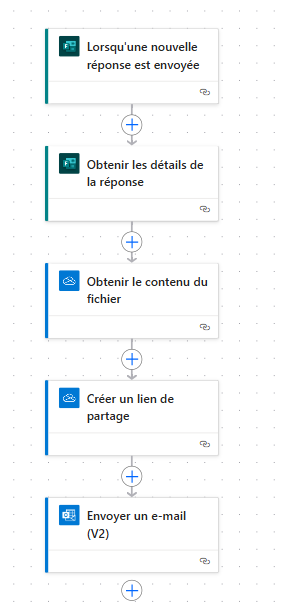

**AUTOSHARE TEAMS – ACCÈS CONTRÔLÉ AUX ENREGISTREMENTS VIA MICROSOFT FORMS & POWER BI**

Le travail consiste à envoyer par mail le lien de l'enregistrement du call Teams stocké dans one drive après qu'un formulaire soit remppli. 
Pour ce faire, il faut d'abord créer le **formulaire** avec **Microsoft forms**. Ce formulaire possède  3 champs à savoir :
- le nom (obligatoire),
- l'adresse mail(obligatoire),
- l'entreprise
  
Après avoir créé le formulaire, on vient maintenant dans **Power Automate** pour faire l'automatisation. 
- On commence d'abord par choisir **Lorsqu'une nouvelle réponse est envoyée** comme **déclencheur automatique**.
- Ensuite, on choisit comme action **Obtenir les détails de la réponse** : cette action nous permet d'obtenir l'**adresse mail** des participants  que nous utiliserons plus tard pour leurs envoyer le lien de l'enregistrement. 
- Puis, on choisit comme nouvelle action **Obtenir le contenu du fichier** : avec cette action, on selectionne dans **One Drive**, le dossier **Recordings** contenant tous les enregistrements, pour choisir celui que l'on souhaite partager.
- Après, on prend comme action suivante **Créer un lien de partage** : cette action consiste à créer le lien de partage de l'enregistrement choisi lors de l'action précedente.
- Enfin, on prend **Envoyer un e-mail (V2)** comme dernière action : ici, on utilise l'adresse mail que chaque participant a rempli dans le formulaire pour leurs envoyer le lien de l'enregistrement du call teams.

